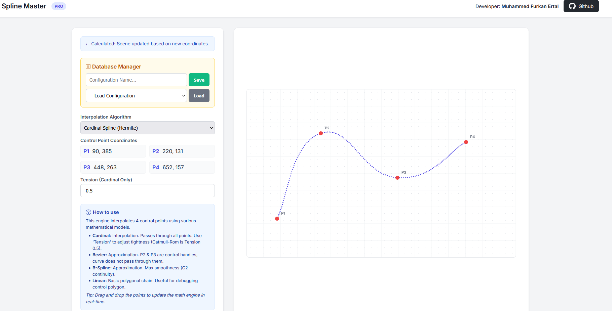
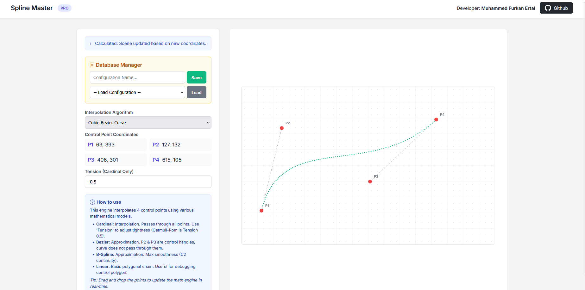
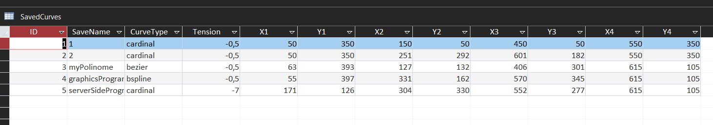

# 📈 Spline Master Pro


**Spline Master Pro** is an advanced educational web application designed to visualize and manipulate mathematical curves in real-time. 

It features a unique **hybrid architecture**:
* **Backend:** Mathematical calculations (Polynomials, Basis Functions) are processed on the server-side using **Classic ASP (VBScript)**.
* **Frontend:** Rendering and interactivity are handled by **HTML5 Canvas** and **JavaScript**.
* **Persistence:** Configuration states are saved and loaded using a **Microsoft Access Database (.mdb)**.

---

## 🚀 Features

* **Server-Side Math Engine:** All spline interpolations are calculated using raw VBScript logic on the server, demonstrating strong backend algorithmic skills.
* **Interactive UI:** Drag-and-drop control points with real-time coordinate updates.
* **Database Integration:** Save and Load your curve configurations using an MDB database.
* **Multi-Algorithm Support:**
    * **Cardinal Spline (Hermite):** Passes through all points with adjustable *Tension*.
    * **Cubic Bézier Curve:** Uses control handles for smooth approximations.
    * **Uniform Cubic B-Spline:** Provides $C^2$ continuity for maximum smoothness.
    * **Linear Interpolation:** Visualizes the raw control polygon.
* **Modern Design:** Fully responsive, English interface styled with CSS3 and Inter font family.

---

## 🧮 Supported Algorithms

| Algorithm | Type | Description |
| :--- | :--- | :--- |
| **Cardinal Spline** | Interpolation | Passes directly through all 4 control points. The shape is controlled by a `Tension` parameter (default -0.5). |
| **Cubic Bézier** | Approximation | The curve starts at P1 and ends at P4. P2 and P3 act as control handles (magnets) that define the tangent directions. |
| **B-Spline** | Approximation | The smoothest curve type. It may not pass through any control points but guarantees the smoothest transitions between segments. |

---

## 🛠️ Installation & Setup

Since this project runs on **Classic ASP**, it requires a Windows-based server environment.

### Option 1: Baby Web Server (Recommended for simplicity)
1.  Download **Baby Web Server**.
2.  Place the project files (`spline.asp`, `style.css`, `splines.mdb`) into the `www` or root folder of the server.
3.  Double click the server executable to start it.
4.  Open your browser and navigate to: `http://localhost/index.asp` (Check your port number).

### Option 2: IIS (Internet Information Services)
1.  Enable **ASP** feature in Windows Features > IIS > World Wide Web Services > Application Development Features.
2.  Create a new site or application in IIS Manager pointing to the project folder.
3.  **Important:** Give **Write/Modify permissions** to the `IUSR` user for the `splines.mdb` file (required for Saving data).

---

## 📂 Project Structure

```text
spline-master-pro/
│
├── spline.asp      # The Core Application (VBScript Engine + HTML UI)
├── style.css       # Modern CSS3 Styling
├── splines.mdb     # Microsoft Access Database (Data Persistence)
└── README.md       # Project Documentation
```

## 💻 Technical Workflow

    User Action: User drags a point on the HTML5 Canvas.

    Auto-Submit: On mouseup, JavaScript submits the form data (X, Y coordinates) to the server.

    Server Calculation:

        The ASP engine receives the coordinates.

        It applies the selected mathematical formula (e.g., Hermite Basis Functions).

        It generates hundreds of intermediate points.

    Response: The server generates JavaScript draw commands (e.g., drawPoint(x,y)) and sends the page back.

    Rendering: The browser executes the new JavaScript commands to paint the updated curve.

## 📷 Screenshots

### Cardinal Spline


### Cubic Bezier Curve


### Database


## 📝 License

This project is open-source and available under the MIT License.

Developer: Muhammed Furkan Ertal
